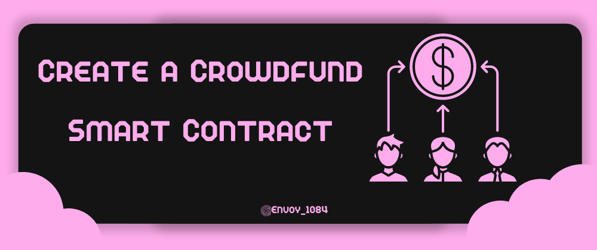
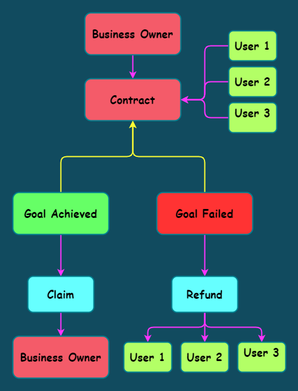

# Create a Crowdfund Smart Contract using Solidity



## What is Crowdfund

`Crowdfunding is the practice of using modest sums of money from a large number of people to finance a new business endeavor.`

Let's say I want to open a modest tea shop, but I lack the resources or cash to do so. What then can I do?
Either I can get a loan from a friend, my family, or the bank, or I may ask someone to give me money and work with me on a project. Crowdfunding will be used if the project is too large for a single investor to invest in. I will solicit money from anyone in exchange for shares of my business, and each investment will possess a part in the business.

---

## How does it work?

Look at this illustration of the structure we plan to build first.



- The business owner calls the contract to launch a campaign using several justifications, including the number of tokens that must be raised for the campaign, its start timestamp, and its end timestamp.
- As long as the campaign has not already begun, the business owner may cancel it at any time.
- By using the "pledge" function and entering the "id" of the campaign along with the number of tokens to be pledged, users can donate their tokens to a particular campaign.
- As long as the campaign is still active, they can also withdraw their previously pledged tokens.
- After the campaign is over, one of the two possible results is -
  - A campaign is considered successful when it raises the required number of tokens and meets the business owner's minimum requirements. In this scenario, the business owner can call the "claim" function to withdraw all the tokens.
  - If not enough tokens are pledged, which is the other scenario where a campaign fails, pledgers can withdraw their tokens from the contract by using the "withdraw" function.

---

## Smart Contract

**PREREQUISITE**

- Basics of [Remix](https://remix.ethereum.org/#optimize=false&runs=200&evmVersion=null&version=soljson-v0.8.7+commit.e28d00a7.js) IDE.
- Some Basic Knowledge of Solidity and ERC-20 Tokens.

---

First, we specify our license and the Solidity version we intend to use. The version we are working on is indicated by `pragma solidity`; take note that our compiler version must match for there to be no error signs.
Version `0.8.7` will be used in this article.

```solidity
// SPDX-License-Identifier: MIT
pragma solidity ^0.8.7;
```

To help the contract call the `transfer` and `transferFrom` functions from the ERC-20 Token Contract, we will now construct an Interface for our ERC-20 Tokens.

```solidity
interface IERC20 {
    function transfer(address, uint) external returns (bool);

    function transferFrom(
        address,
        address,
        uint
    ) external returns (bool);
}
```

We now declare some state variables to begin our smart contract.

- **Campaign** - A `struct` for storing data on the campaign's creator, aim, start time, end time, and the pledged tokens.
- **token** - to refer to the ERC-20 Token contract used for token transfers.
- **count** - to keep track of campaigns.
- **maxDuration** - Specify the maximum duration a campaign can be hosted.
- **campaigns** - a `mapping` that connects campaigns to their ID
- **pledgedAmount** - a `mapping` to link the user's address and the number of tokens they pledged, and another `mapping` to link the campaign id.

```solidity
struct Campaign {
        address creator;
        uint goal;
        uint pledged;
        uint startAt;
        uint endAt;
        bool claimed;
    }

    IERC20 public immutable token;
    uint public count;
    uint public maxDuration;
    mapping(uint => Campaign) public campaigns;
    mapping(uint => mapping(address => uint)) public pledgedAmount;
```

Next, we designate some actions as events that will occur if a campaign is started, a token is pledged or unpledged, a campaign is cancelled, or a token is claimed or withdrawn.

```solidity
event Launch(
        uint id,
        address indexed creator,
        uint goal,
        uint32 startAt,
        uint32 endAt
    );
    event Cancel(uint id);
    event Pledge(uint indexed id, address indexed caller, uint amount);
    event Unpledge(uint indexed id, address indexed caller, uint amount);
    event Claim(uint id);
    event Refund(uint id, address indexed caller, uint amount);
```

Next, we set up our contract's constructor, which requires the address of the ERC-20 token and the maximum time a campaign can be hosted, as its two inputs.

```solidity
constructor(address _token, uint _maxDuration) {
        token = IERC20(_token);
        maxDuration = _maxDuration;
    }
```

Our first function, "launch," which accepts the campaign's goal, the start timestamp, and the end timestamp, is now defined.

Before starting the campaign, we first perform some checks.

1. We determine whether the commencement time exceeds the current time.
2. We make sure the end time is later than the beginning time.
3. Finally, we make sure the campaign does not go beyond its maximum time.

After that, we raise our `count` variable. The campaign information is then stored in the `campaigns` mapping, with the count variable serving as the key and a struct as the value.

And finally emit the `Launch` event

```solidity
function launch(uint _goal, uint32 _startAt, uint32 _endAt) external {
        require(_startAt >= block.timestamp,"Start time is less than current Block Timestamp");
        require(_endAt > _startAt,"End time is less than Start time");
        require(_endAt <= block.timestamp + maxDuration, "End time exceeds the maximum Duration");

        count += 1;
        campaigns[count] = Campaign({
            creator: msg.sender,
            goal: _goal,
            pledged: 0,
            startAt: _startAt,
            endAt: _endAt,
            claimed: false
        });

        emit Launch(count,msg.sender,_goal,_startAt,_endAt);
    }
```

Next, we define a function called cancel, which allows the campaign's creator to end the campaign provided that they are the campaign's creator and that the campaign has not yet begun.

```solidity
function cancel(uint _id) external {
        Campaign memory campaign = campaigns[_id];
        require(campaign.creator == msg.sender, "You did not create this Campaign");
        require(block.timestamp < campaign.startAt, "Campaign has already started");

        delete campaigns[_id];
        emit Cancel(_id);
    }
```

We have now developed our pledge feature, which asks for the campaign id and the number of tokens that need to be pledged.

In order to transfer tokens from the user to the smart contract, we first run basic tests, such as determining whether the campaign has begun or concluded. Next, we use the token variable, which corresponds to the IERC interface and call the `transferFrom` function to transfer tokens from the user to the smart contract.

By increasing the amount of tokens offered by the campaign and storing the number of tokens pledged by the user, we modify the state variables of the contract.

And then we emit the `Pledge` event.

```solidity
function pledge(uint _id, uint _amount) external {
        Campaign storage campaign = campaigns[_id];
        require(block.timestamp >= campaign.startAt, "Campaign has not Started yet");
        require(block.timestamp <= campaign.endAt, "Campaign has already ended");
        campaign.pledged += _amount;
        pledgedAmount[_id][msg.sender] += _amount;
        token.transferFrom(msg.sender, address(this), _amount);

        emit Pledge(_id, msg.sender, _amount);
    }
```

We provide a function called `unpledge` that removes the tokens that a user has pledged, just as the pledge function.

```solidity
function unPledge(uint _id,uint _amount) external {
        Campaign storage campaign = campaigns[_id];
        require(block.timestamp >= campaign.startAt, "Campaign has not Started yet");
        require(block.timestamp <= campaign.endAt, "Campaign has already ended");
        require(pledgedAmount[_id][msg.sender] >= _amount,"You do not have enough tokens Pledged to withraw");

        campaign.pledged -= _amount;
        pledgedAmount[_id][msg.sender] -= _amount;
        token.transfer(msg.sender, _amount);

        emit Unpledge(_id, msg.sender, _amount);
    }
```

The creator can claim all of the tokens raised for the campaign with the help of a claim function that we define next if the following criteria are met.

1. the campaign's originator is the one who called the function.
2. The campaign has come to a close.
3. The objective has been surpassed by the quantity of tokens raised (campaign succeded)
4. The tokens have not yet been redeemed.

```solidity
function claim(uint _id) external {
        Campaign storage campaign = campaigns[_id];
        require(campaign.creator == msg.sender, "You did not create this Campaign");
        require(block.timestamp > campaign.endAt, "Campaign has not ended");
        require(campaign.pledged >= campaign.goal, "Campaign did not succed");
        require(!campaign.claimed, "claimed");

        campaign.claimed = true;
        token.transfer(campaign.creator, campaign.pledged);

        emit Claim(_id);
    }
```

In the event that the campaign is unsuccessful, we create a refund function that allows users to withdraw their tokens from the contract.

```solidity
function refund(uint _id) external {
        Campaign memory campaign = campaigns[_id];
        require(block.timestamp > campaign.endAt, "not ended");
        require(campaign.pledged < campaign.goal, "You cannot Withdraw, Campaign has succeeded");

        uint bal = pledgedAmount[_id][msg.sender];
        pledgedAmount[_id][msg.sender] = 0;
        token.transfer(msg.sender, bal);

        emit Refund(_id, msg.sender, bal);
    }
```

This is how a crowd funding contract is created, allowing users to establish campaigns and donate tokens to various projects.

---

---
